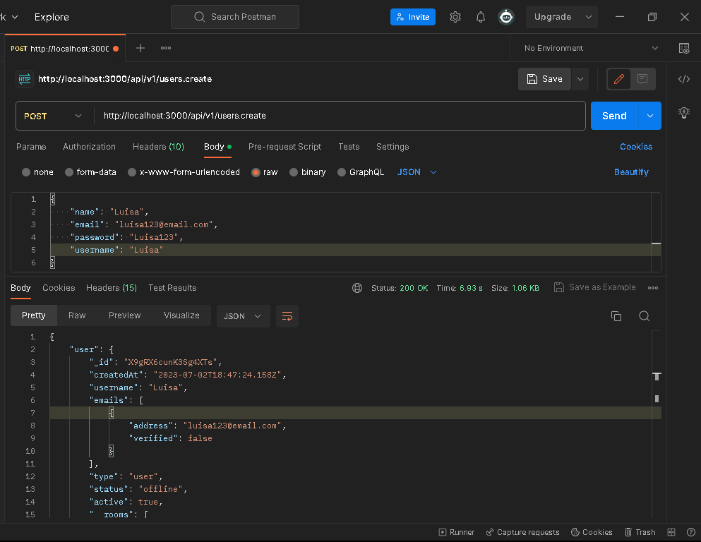
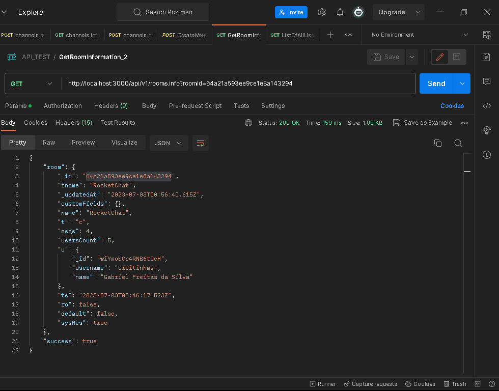
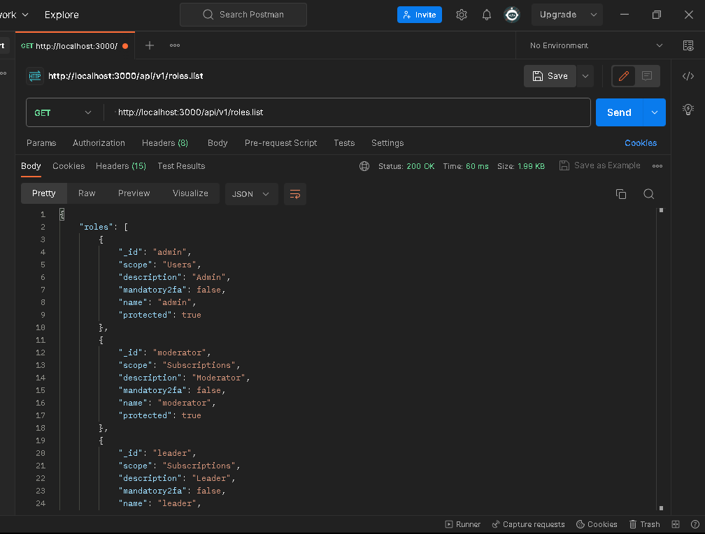

# Steps to install.

To get my laptop ready for deployment, I used the tools pointed out below.

LocalTunnel is a tool that allows me to set my localhost as a ip public.

### Tools: 
1. Docker desktop
2. Rocket.chat environment
3. LocalTunnel
   

## Installation
___
### 1 _ Docker Desktop:

Go to https://docs.docker.com/desktop/install/windows-install/, download and install.

---
### 2 _ Rocket.chat environment:

1. Download and install: WSl 2 - Install Linux on Windows with WSL.
2. Download and install the latest Linux Kernel Updates.
3. Download and install:: NodeJS.
4. Install Meteor.

---
### 3_ LocalTunnel:
1. run on WSL 2: npm install -g localtunnel
___

# Rocket.chat API Test

Searching the Rest API documentation on rocket.chat.com, we have all the necessary documentation to run these queries.

As the documentation points out, authentication is required for any query/update. For this, I created in the header the X-Auth-Token and X-User-Id, which are generated in the Token access tool on Rocket.chat workspace.

---

### 1 _ Create a new user via an API endpoint
---
To create a new user, do you need to send a post request on postman,

Method: POST.

- run: localhost:3000/v1/api/users.create

Required Argument:
E.g: 
{"name": "Luisa",
"email": "luisa123@email.com",
"password": "Luisa123",
"username": "Luisa"
}

Fill the required data and then do you *create a user*.

---
### 2 _ Get the room information via an API endpoint
---

To be able to get the room information do you have to create a channel.

Creating a channel you will generate an roomId.

To create a channel do you need to run this command on postman:

Method: POST.

- http://localhost:3000/api/v1/channels.create

Required argument ->
{name:RocketChat}

*Then you generate an id, using this id we will be able to get the room info.*

TO GET THE ROOM INFORMATION:

Method: GET.

- Run this query -> http://localhost:3000/api/v1/rooms.info?roomId=64a21a593ee9ce1e8a143294

Required argument:
roomId: Id do you generate when create a group.

Done.

You get the room information.

---
### 3 _ Get a list of all user roles in the system via an API endpoin
---
Method: GET

To get all the users roles do you need to run a get command on postman:

 - run: http://localhost:3000/api/v1/roles.list

And done do you have all the roles a user can be.

